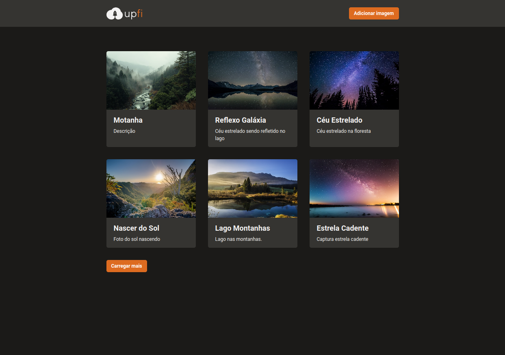
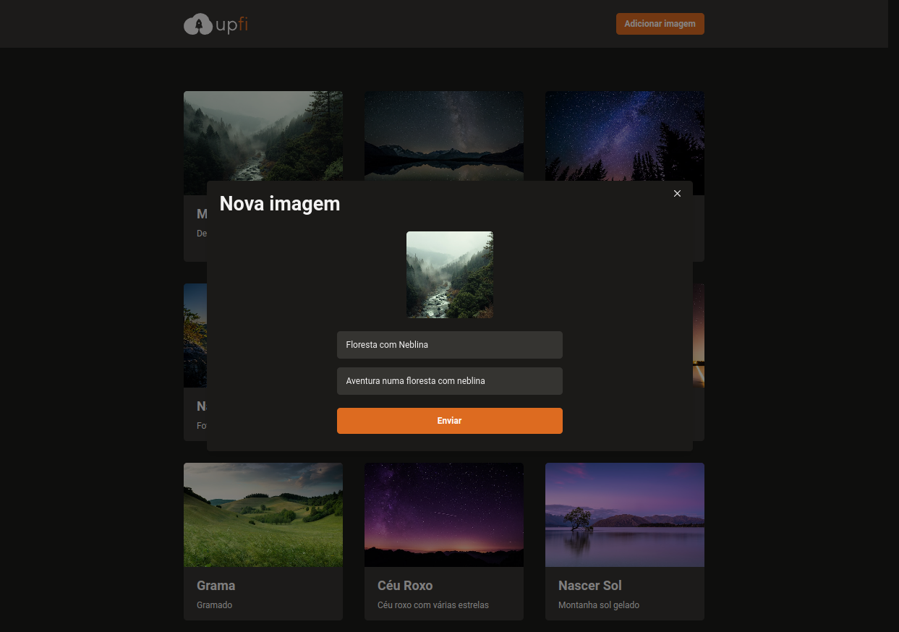

<h1 align="center">
  <p>up<span style="color: #DD6B20">fi</span></p>
</h1>

<p align="center">
  
  
  
  
  
  
  
  
  
  

</p>

---

<p align="center">
  <a href="#-projeto">Projeto</a>&nbsp;&nbsp;&nbsp;|&nbsp;&nbsp;&nbsp;
  <a href="#-como-rodar-o-projeto">Como rodar o projeto</a>&nbsp;&nbsp;&nbsp;|&nbsp;&nbsp;&nbsp;
  <a href="#-tecnologias">Tecnologias</a>&nbsp;&nbsp;&nbsp;|&nbsp;&nbsp;&nbsp;
  <a href="#-layout">Layout</a>&nbsp;&nbsp;&nbsp;|&nbsp;&nbsp;&nbsp;
  <a href="#-licença">Licença</a>
</p>

## 💻 Projeto

Bem-vindo ao **Upfi**, o lugar ideal para compartilhar suas imagens com o mundo! Com o **Upfi**, você pode fazer upload de suas imagens favoritas em formatos como JPG, GIF e PNG, junto com um título e descrição para que outros possam encontrá-las facilmente.

Nosso design simples e intuitivo permite que você faça upload de imagens em questão de segundos, sem precisar se preocupar com a formatação ou tamanho. Todas as imagens cadastradas são exibidas dinamicamente em uma única página, carregando de 6 em 6, com um botão "carregar mais" que permite trazer mais dados quando necessário.

E se você quiser adicionar ainda mais imagens, basta clicar em nosso botão de adicionar imagem e um modal aparecerá para que você possa fazer upload de novas imagens de forma rápida e fácil. O **Upfi** é o lugar perfeito para compartilhar suas fotos favoritas, encontrar inspiração e se conectar com outras pessoas através de imagens.

Não perca tempo e comece a compartilhar suas imagens com o mundo hoje mesmo!

### 🌐 Telas do site

**Lista de imagens**



**Adicionando imagem**



## 🧭 Como rodar o projeto

### 🚨 Requisitos

**Possuir uma conta no FaunaDB**

- [FaunaDB](https://fauna.com/)
- Criar [_database_](https://dashboard.fauna.com/)
- Criar [_collection_](https://dashboard.fauna.com/)
- Criar [_database keys_ ](https://dashboard.fauna.com/)

**Possuir uma conta no ImgDB**

- [ImgDB](https://imgbb.com/)
- Criar [_api key_](https://api.imgbb.com/)

**Clone este repositório**

```bash
git clone git@github.com:vitorsemidio-dev/upfi.git
```

**Acesse a pasta**

```bash
cd upfi
```

### 🔑 Variáveis Ambiente

Crie um arquivo com o nome `env.local` e preencha as informações.


```env
# FaunaDB
FAUNA_API_KEY=

# ImgDB
NEXT_PUBLIC_IMGBB_API_KEY=
```

**Instale as dependências e inicie o projeto**

```bash
yarn install
```

```bash
yarn dev
```

## 🚀 Tecnologias

Esse projeto foi desenvolvido com as seguintes tecnologias:

- [Axios](https://axios-http.com/)
- [Chakra UI](https://chakra-ui.com/)
- [ESLint](https://eslint.org/)
- [FaunaDB](https://fauna.com/)
- [Next.js](https://nextjs.org/)
- [Prettier](https://prettier.io/)
- [React](https://reactjs.org/)
- [React Testing Library](https://testing-library.com/)
- [TypeScript](https://www.typescriptlang.org/pt/)

## 🔖 Layout

Você pode visualizar o layout do projeto através [deste link](https://www.figma.com/file/QKxbxCVwwlDLMrCtHae239/Desafio-2-M%C3%B3dulo-4-ReactJS).

<a href="https://www.figma.com/file/QKxbxCVwwlDLMrCtHae239/Desafio-2-M%C3%B3dulo-4-ReactJS">
  
</a>

## 📝 Licença

Esse projeto está sob a licença MIT. Veja o arquivo [LICENSE](LICENSE) para mais detalhes.
